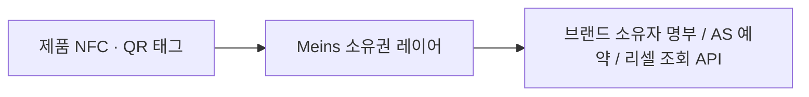
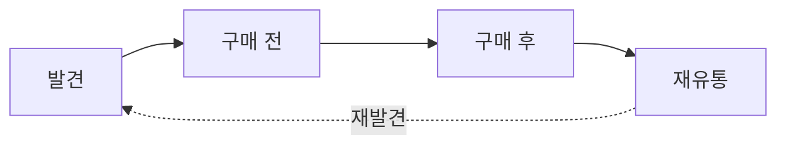
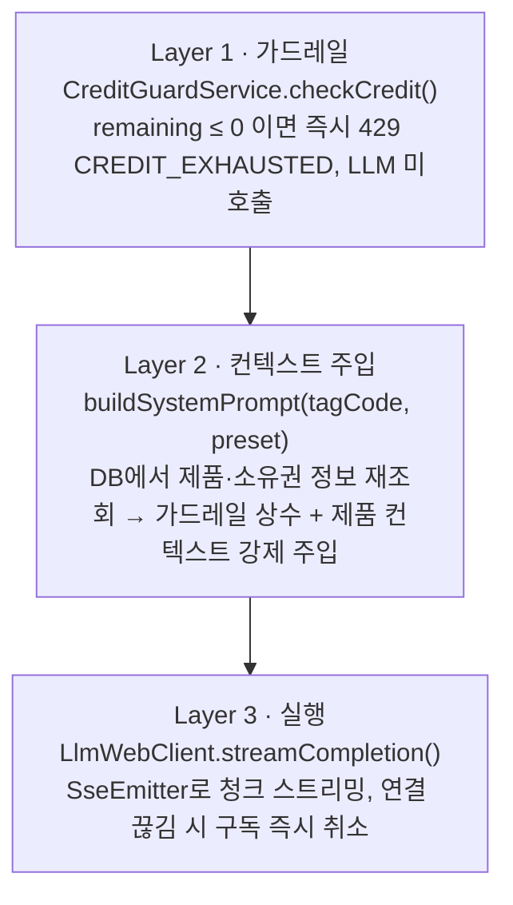

<div align="center">

# Meins

### MCM 온보딩 백엔드 — 디지털 제품 여권 위에 얹는 소유권 레이어

*"내 것": 발견에서 재유통까지 소비자와 브랜드를 연결하는 디지털 제품 여권*

[](#)
[](#)
[](#)
[](#)
[](#)

서울과학기술대학교 중앙해커톤(SJF Track) 14기 · Team 이얏호 출품작

</div>

---


> **고객이 바뀌어도 제품은 남습니다. Meins는 제품을 여정의 주체로 삼습니다.**

MCM 제품에 부착된 QR/NFC 태그를 스캔하면 소유권을 등록하고, 소유자 전용 AI 컨시어지와 대화할 수 있는 서비스다.

## 목차

- [서비스 한눈에 보기](#서비스-한눈에-보기)
- [왜 지금 필요한가](#왜-지금-필요한가)
- [소비자가 진짜 원하는 것](#소비자가-진짜-원하는-것)
- [솔루션 — 태그와 소유권 결합](#솔루션--태그와-소유권-결합)
- [동작 방식 — 스캔에서 대화까지 세 단계](#동작-방식--스캔에서-대화까지-세-단계)
- [비즈니스 모델](#비즈니스-모델)
- [경쟁 환경과 차별점](#경쟁-환경과-차별점)
- [GTM 로드맵](#gtm-로드맵)
- [백엔드 구현](#백엔드-구현)
  - [요청 처리 흐름](#요청-처리-흐름-chat)
  - [기술 스택](#기술-스택)
  - [빠른 시작](#빠른-시작)
  - [API 개요](#api-개요)
  - [프로젝트 구조](#프로젝트-구조)
  - [배포](#배포)
- [문서](#문서)
- [팀](#팀)

---

## 서비스 한눈에 보기

| 구분 | 내용 |
|---|---|
| 고객 (1차 고객 / 비용 지불) | 럭셔리 브랜드 |
| 최종 사용자 | 제품 소유자 |
| 제공물 | 기존 NFC/QR 태그 위에 얹는 소유권 인증 및 대화 레이어 |
| 비즈니스 모델 | B2B SaaS · 구독 + 사용량 혼합 과금 |
| 과금 구조 | DPP 발급 1회 + 활성 시리얼 연간 구독 + 사용량 기반 3개 계층 |



브랜드가 이미 붙인 태그가 지금은 eBay 같은 리세일 플랫폼의 리스팅 진입점으로 흡수되고 있다. Meins는 그 태그 위에 소유권 레이어 한 겹만 더해 **브랜드 자신의 소유자 명부**로 전환한다.

## 왜 지금 필요한가

**럭셔리의 상수, 위조**

| 지표 | 수치 |
|---|---|
| 세계 위조품 교역 규모 (2021 세관 압수 데이터 기준) | **4,670억 달러** |
| 세계 수입에서 위조품이 차지하는 비중 (EU 수입 기준 최대) | **최대 2.3%** (EU 4.7%) |
| 압수 물량 중 의류·신발·가죽제품 비율 | **62%** |

증명 비용은 소유자가 떠안는다 — 중고 거래 경험자의 정품 증명 수단은 영수증·보증서 제시 53%, 구성품 사진 35%였고, **아무것도 하지 않았다는 응답도 29%**였다. 종이 보증서와 사진은 그 자체로 복제 가능한 물리 매체이며, 브랜드 공식 기록에 근거한 판정이 없으면 증명의 신뢰는 계속 사설 감정 비용으로 전가된다.

**동시에 진행 중인 인프라 선점 경쟁**

| 시점 | 사건 |
|---|---|
| 2024.05 | eBay, Certilogo 태그 스캔 시 재판매 버튼 노출 기능 출시 |
| 2024.07 | MCM, Aura 컨소시엄 합류 — NFC 기반 첫 DPP 도입 |
| 2026.07 | EU 집행위 DPP 레지스트리 가동 |
| 2027 하반기 | 섬유 및 의류 위임법 채택 목표 (범위 미확정) |

브랜드의 태그가 플랫폼의 진입점이 되고 있다 — eBay는 브랜드가 붙인 태그를 스캔하면 재판매 버튼이 뜨게 했고, 소유자 확인과 거래 이력은 플랫폼 계정에 쌓인다. 그 사이 럭셔리 고객은 2022년 4억 명에서 2025년 약 3억 4천만 명으로 줄었고, 이탈 고객의 70% 이상은 돌아올 의사가 있으나 반드시 같은 브랜드로 돌아가지는 않는다.

**제품을 증명할 뿐인 현재의 디지털 제품 여권**

| 현재: 제품에 귀속된 기록 | 필요: 소유자에게 귀속된 레이어 |
|---|---|
| 개체에 사양·소재·지속가능성 문서가 붙는다 | 개체에 지금의 소유자가 연결된다 |
| 지금 누가 가졌는지 알 수 없다 | 중고거래 시 소유권이 이전된다 |
| 규제 대응용으로 설계되었다 | 케어 및 수선 이력이 개체에 누적된다 |

구매 후 "제품과 관련된" 연락을 받지 못한 응답자 **92%**, 보증서·구매 증빙의 소재를 특정하지 못한 응답자 **76%**, 브랜드에서 연락을 받았다는 응답자 **19명 전원**이 그 내용에 신제품·할인 광고만 포함되어 있었다고 답했다. EU 레지스트리 역시 식별자와 여권의 위치만 등록하고 실제 데이터는 분산 보관한다 — 소유 데이터를 누가 쥐는지는 규제가 정해주지 않는다.

## 소비자가 진짜 원하는 것

규제가 의무화한 정보가 아니라, 인증·케어·보증·리셀이다.

**DPP 이용 의향** (데스크 리서치, 럭셔리 소비자 330명, 유럽)

| 항목 | 이용 의향 |
|---|---|
| 정품 인증 | 87% |
| 케어·수선 | 86% |
| 보증 | 83% |
| 리셀 | 82% |
| 지속가능성 정보 (규제 의무화 항목) | **71%** (가장 낮음) |

**브랜드 제품 구매 후 사용자 경험** (자체 설문, 국내 20대 50명)

| 응답 내용 | 비율 |
|---|---|
| 구매 후 제품 관련 연락 없음 | 92% |
| 보증서 소재 특정 불가 | 76% |
| 정품 확인은 브랜드가 낫다 (플랫폼 2%) | **98%** |
| 공식 AS 미이용 | 68% |

**Insight** — 규제가 의무화한 항목(지속가능성 정보)이 가장 낮은 이용 의향을 보이는 반면, 브랜드가 운영하는 쪽을 신뢰한다는 응답이 압도적으로 많다. 소비자가 원하는 건 "여권"이 아니라 "브랜드와의 지속적인 접점"이다.

## 솔루션 — 태그와 소유권 결합

구축된 인프라(Aura, Arianee 등 제품 여권 발급 체계) 위에 소유권 레이어를 쌓아 판매 시점에서 끊기던 브랜드 여정을 다시 잇는다. **Aura를 대체하지 않고, Aura가 발급한 제품 여권 위에 소유권 계층만 추가한다.**

| 이해관계자 | 얻는 것 |
|---|---|
| 브랜드 | 소비자 수요를 브랜드 입장에서 해결해 소유자들의 브랜드 충성도가 올라간다 |
| 소유자 | 내 개체의 이력이 주입된 전용 컨시어지 — 케어·스타일링·헤리티지를 브랜드 공식 정보로 응답받는다 |
| 구매자 (중고 구매) | 사설 감정 없이 브랜드 공식 유통 기록 기반의 진위 확인 — 리셀 시 증명 비용과 시간이 사라진다 |



- **발견** — 타인의 제품을 스캔하거나, 소유자가 공유한 소유 증명 카드 링크로 진입한다.
- **구매 전** — 중고 구매자가 사설 감정 없이 브랜드 공식 판정을 확인한다.
- **구매 후** — 소유권 등록으로 오너 뷰가 열린다. 개체 이력이 주입된 대화와 공식 수선 전환이 지속 접점을 만든다.
- **재유통** — 이양 코드로 소유권이 넘어간다. 케어 및 수선 이력은 개체에 누적되어 승계되고, 브랜드 접점은 끊기지 않는다.

## 동작 방식 — 스캔에서 대화까지 세 단계

| 단계 | 이름 | 설명 |
|---|---|---|
| 1 | 게스트 뷰 | 공식 유통 기록 기반 조회 결과. 로그인·앱 설치 없이 QR/링크로 즉시 진입 |
| 2 | 소유권 등록 | QR과 다른 경로(구매 시 함께 전달되는 인증 코드)로 받은 코드를 입력 — 태그를 복제해도 소유자 지위는 얻을 수 없다 |
| 3 | 오너 뷰 (프라이빗 대화형 컨시어지) | 개체 이력이 주입된 프라이빗 대화형 컨시어지. 케어·스타일·헤리티지 등 원하는 맥락으로 질문 가능 |

**왜 2단 게이팅인가** — 소유 레코드 자체가 컨시어지 사용 권한에 포함되기 때문이다. 등록 시점에 케어 이력과 컨시어지 대화가 함께 잠금 해제되어, 등록의 대가가 즉시 눈에 보인다.

온보딩 설계 원칙 4가지:

| 원칙 | 내용 |
|---|---|
| 마찰 제거 | 앱 설치와 로그인 없이 스캔 즉시 진입. 등록은 코드 입력 한 번으로 끝난다 |
| 등록 유인 | 컨시어지 대화와 케어 이력이 등록 시점에 잠금 해제되어 대가가 즉시 눈에 보인다 |
| 발급 경로 분리 | 인증 코드는 QR과 다른 경로로 구매자에게 발송되어, 태그를 복제해도 소유자 지위를 얻을 수 없다 |
| 실패 대비 | 코드 분실 시 재발송, 매장 방문 등록, 구매 이력 대조를 보조 경로로 둔다 |

> 1순위 KPI: **소유권 등록 전환율**

## 비즈니스 모델

**활성 시리얼 수를 핵심 과금 단위로 삼는다.**

| 과금 기준 | 단가 | 3년차 매출 비중 |
|---|---|---|
| DPP 발급 (신규 개체 1건당, 1회) | 1,200원 | 46% |
| 활성 유지 구독 (활성 시리얼 1개당, 연간) | 300원 | 25% |
| NFC 태그 공급 (신규 개체당 마진) | 150원 | 6% |
| 수선 / AS 전환 (예약 건당, 미검증) | 15,000원 | 19% |
| 진위 조회 API (조회 1건당, 미검증) | 500원 | 4% |

| 지표 | 상향식 (활성 개체 기준) | 하향식 (DPP 시장 세그먼트 기준) |
|---|---|---|
| TAM | 660억 원 | 1,380억 원 |
| SAM | 390억 원 | 276억 원 |

**SOM 14.6억 원** — 3년차 시점 3사 합산 105만 개, SAM 대비 3.7% (3사 정상 상태 도달 시 23.4억 원, 6.0%).

<details>
<summary>단위경제 상세 (브랜드 1개사 기준)</summary>

- 기여이익률 67% · 누적현금회수 23개월 · 3년차 ARPA 7.79억 원
- CAC 4.0억 원 (GTM 4인 인건비 2.6억 + 파일럿/보안심사 1.4억, 연 신규 1건 기준)
- LTV 20.2억 원 (5년 유지 가정) · **LTV/CAC 5.1배** (엔터프라이즈 벤치마크 허용 범위 18~24개월)
- 3개년 매출 추정: 1년차 0.94억 → 2년차 5.89억 → 3년차 7.79억, 3년 누적 14.6억 원
- 3년차 손익(3사, 연 1사 획득 기준): 매출 14.6억 / 변동원가 4.8억 / GTM 4.0억 / 고정비 2.6억 = 영업이익 3.2억, 3사 정상 상태 영업이익 9.1억
- 미검증 항목: AS 수수료 15,000원과 진위 조회 API 500원은 공개 단가 자료가 없는 가정값 — 두 계층 합계가 3년차 매출의 23%를 차지

출처: Renoon DPP 플랫폼 시장 분석 2026(발급당 €0.50~2.00, 3티어 구조) · Aura Blockchain Consortium 2024.09 · NFC 태그 €0.05~0.30 · B2B SaaS 벤치마크 2026(LTV/CAC 중앙값 3.2배, 엔터프라이즈 4.5배)

</details>

## 경쟁 환경과 차별점

| 플레이어 | 포지션 |
|---|---|
| Aura 블록체인 컨소시엄 | 제품 여권 발급 인프라, 브랜드 통제 하에 있으나 소유자 식별 계층은 아님. MCM이 회원사이므로 경쟁이 아닌 기반으로 규정 |
| **Arianee** (가장 유사한 경쟁자) | 럭셔리 브랜드에 소유권 증명·이전·사후 서비스 제공 중. 브라이틀링이 SaaS 플랫폼을 자사 IT에 통합. 소유권 레이어 자체는 신규 개념이 아님 |
| 국내 리셀 플랫폼 (크림, 번개장터, 중고나라 등) | 플랫폼 자체 감정으로 신뢰를 확보. 브랜드는 판정과 데이터 양쪽에서 배제됨 |
| Certilogo (eBay) | 브랜드에 디지털 ID를 제공하나, 스캔 시 재판매 버튼이 노출되어 거래와 소유자 확인이 플랫폼 계정에 귀속 |

**실제 공백은 소유권이 아니라 대화입니다.** 기존 플랫폼의 소유자와의 접점은 브랜드가 보내는 일방향 알림/메시지뿐이다. 소유자가 자기 개체에 대해 묻고, 그 개체의 이력에 근거한 답을 받는 층은 아직 없다. 지갑 연결 등 진입이 복잡해 등록 단계에서 이탈도 발생한다. **Meins는 이 공백을 파고든다.**

<details>
<summary>차별점과 해자 상세</summary>

| 축 | 내용 |
|---|---|
| 개체 이력 기반 대화 | 경쟁 플랫폼은 브랜드가 보내는 일방향 알림에 머문다. Meins는 개체의 소재·이력·헤리티지를 컨텍스트로 주입해 소유자의 질문에 답한다 |
| 진입은 간편하게 | 기존 솔루션은 지갑 연결 등 복잡한 진입을 요구한다. Meins는 스캔 후 코드 입력 한 번으로 등록 전환율에서 격차를 벌린다 |
| 기존 여권 위에 얹는 레이어 | Aura와 Arianee가 발급한 여권을 대체하지 않고 그 위에 소유권과 대화 계층만 추가해 도입 저항과 전환 비용을 낮춘다 |
| 소유 이력의 축적 | 개체마다 등록·이전·수선 이력이 쌓인다. 이력을 버리고 다른 솔루션으로 옮기는 비용이 시간이 갈수록 커진다 |
| 브랜드 가치 강화 | 컨시어지 톤 고정, 구매액이 아닌 소유 기준 혜택, 공식 채널 안에서만 리셀 증명 — 검증 데이터 범위 밖 생성 금지 등으로 브랜드 톤을 관리한다 |
| 브랜드 자산을 솔루션으로 | MCM 자산과 Meins 기능을 매핑 — Aura 기반 NFC DPP는 레이어의 기반, 컬렉션 헤리티지는 컨시어지 콘텐츠, 매장 AS 네트워크는 수선 전환 경로로 삼는다 |

</details>

## GTM 로드맵

단일 라인 파일럿에서 등록 전환율을 실측하고, 결과 수치를 기반으로 확장 계획을 설정한다.

| 단계 | 내용 | KPI |
|---|---|---|
| 1단계 — 파일럿 | 도입 시점 이후 판매분에 단일 라인 SKU 적용, 브랜드 CRM 조직에 직접 제안, Aura 레퍼런스 경유 | 소유권 등록 전환율 |
| 2단계 — 확대 | 무계정 등록을 기본값으로 유지하며 계정 선택 제공, 앱 전환으로 보유 제품 통합 관리, 전 라인 확대 | 구매 후 접점 발생률 |
| 3단계 — 연동 | 소유권 이전과 이력 체인 개방, 리셀 플랫폼 조회 API 연동, 컨시어지 로컬 모델 강화 | 공식 수선 전환율 |

**기대 효과** — 구매 후 접점 0 → 상시/리세일 감정 비용 대체, 브랜드에 귀속되는 제로파티 데이터 확보.
**Meins가 만드는 변화** — 브랜드가 붙인 태그가 플랫폼의 리스팅 진입점이 아니라 브랜드의 소유자 명부로 전환되어, 여정을 반복하며 순환하는 브랜드의 접점으로 작용한다.

<details>
<summary>규제 타임라인 (참고용, 사업 근거로 삼지 않음)</summary>

| 규제 | 내용 |
|---|---|
| ESPR (EU 2024/1781) | 위임법 발효 후 원칙적으로 18개월 경과 전에는 적용 불가 (제4조 4항) |
| 섬유 및 의류 위임법 | EU 집행위 기준 2027년 4분기 채택 계획, 실제 의무 적용은 2028년 이후 전망 |
| DPP 레지스트리 | 2026년 7월 20일 가동. 첫 이행 시한은 2027년 2월 18일, 특정 대형 배터리부터 적용 |
| 리스크 | 가죽 핸드백 포함 여부 미확정. 신발은 우선순위에서 제외되어 2027년 말 재검토 |

개인정보 처리: 브랜드가 관리하고 Meins가 수탁 처리한다. 이메일 등으로 수집을 최소화하며, 제품 양도 시 개인정보는 미승계된다.

출처: EUR-Lex, EU 집행위, JRC / OECD·EUIPO Mapping Global Trade in Fakes 2025(2021 압수 데이터 기준) / Aura Blockchain Consortium 2024.09 / Authentique, Me, The Customer and I 백서 2024(n=330, 유럽 중심) / Bain, Altagamma 2025.11·2026.06 / eBay Inc. 2023.07 및 Certilogo 태그 기능 2024.05 / 팀 자체 실시 설문 2026.08(n=50, 20~25세 92%, 온라인 수집, 20대 브랜드 구매자 편의표본이라 방향성 근거로만 사용)

</details>

---

## 백엔드 구현

여기서부터는 이 레포(백엔드 하네스)가 위 서비스 개념을 어떻게 코드로 구현했는지를 다룬다.

### 요청 처리 흐름 (Chat)

오너 전용 AI 컨시어지 호출은 `ChatHarnessService.streamChat()`이 아래 3계층 순서를 강제한다 — 크레딧 소진 시 LLM을 아예 호출하지 않고, 프론트가 보낸 컨텍스트는 신뢰하지 않고 서버가 tagCode로 직접 재조회한다.



가드레일은 `GUARDRAIL_PROMPT` 상수로 고정되어 매 요청 시스템 프롬프트 최상단에 강제 주입된다 (가품 판정 금지 / 가격 산정 금지 / 리셀 시세 언급 금지). 자세한 설계 배경은 [`chat.md`](chat.md) 참고.

### 기술 스택

| 영역 | 선택 |
|---|---|
| 언어 / 런타임 | Java 17 |
| 프레임워크 | Spring Boot 4.1.0 |
| 웹 계층 | Spring MVC(REST) + WebFlux(WebClient, LLM 스트리밍 호출 전용) |
| 영속성 | Spring Data JPA + MySQL |
| API 문서화 | springdoc-openapi 2.8.5 (Swagger UI) |
| QR 생성 | ZXing |
| 빌드 | Gradle |
| 기타 | Lombok, Bean Validation |

### 빠른 시작

**사전 준비**

- JDK 17
- 실행 중인 MySQL 인스턴스 + 스키마 1개(기본값 `mcm_onboarding`)

**환경 변수** — 프로젝트 루트에 `.env`를 만들고 `.env.example`을 참고해 값을 채운다.

| 변수 | 필수 | 설명 |
|---|---|---|
| `DB_URL` | 선택 | 기본값은 로컬 MySQL(`mcm_onboarding`) |
| `DB_USERNAME` | 선택 | 기본값 `root` |
| `DB_PASSWORD` | **필수** | MySQL 접속 비밀번호 |
| `AI_CHAT_BASE_URL` | **필수** | AI 담당자 RAG 챗 서버 주소 |
| `ADMIN_KEY` | **필수** | `/admin/**` 호출 시 `X-Admin-Key` 헤더로 대조할 고정 키 |
| `QR_URL_TEMPLATE` | 선택 | QR에 인코딩할 URL 템플릿(`{tagCode}` 치환). 비우면 tagCode 원문만 인코딩 |

**실행**

```bash
# 의존성 설치 및 빌드
./gradlew build

# 로컬 서버 기동 (기본 포트 8080)
./gradlew bootRun

# 테스트
./gradlew test
```

기동 후 Swagger UI(`http://localhost:8080/swagger-ui.html`)에서 전체 API를 확인하고 직접 호출해볼 수 있다.

### API 개요

| 도메인 | 메서드/경로 | 설명 |
|---|---|---|
| Tag | `GET /api/tags/{tagCode}` | 게스트 뷰 — 인증 불필요, 제품/유통 정보 조회 |
| Tag | `GET /api/tags/{tagCode}/ownership/me` | 오너 홈 — 오너 토큰 필요 |
| Ownership | `POST /api/tags/{tagCode}/ownership` | 소유권 등록(인증 코드 검증 → 오너 토큰 발급) |
| Ownership | `POST /api/tags/{tagCode}/ownership/transfer-code` | 소유권 이전 코드 발급 |
| Ownership | `DELETE /api/tags/{tagCode}/ownership/transfer-code` | 발급된 이전 코드 취소 |
| Ownership | `POST /api/tags/{tagCode}/ownership/transfer` | 이전 코드로 소유권 이전 |
| Chat | `POST /api/tags/{tagCode}/chat` | 오너 전용 AI 컨시어지, SSE 스트리밍 |
| Chat | `GET /api/tags/{tagCode}/chat/history` | 대화 이력 + 크레딧 잔량 조회 |
| Admin | `POST /admin/tags/bulk-create` | 제품 등록 + 태그 일괄 생성 |
| Admin | `GET /admin/tags` | 관리자용 태그 목록 조회 |
| Admin | `GET /admin/qr/{tagCode}` | QR 이미지(PNG) 즉석 생성 |
| Admin | `GET /admin/tags/qr-export` | 전체 QR을 zip으로 다운로드 |
| Admin | `POST /admin/tags/{tagCode}/force-status` | 상태 강제 변경(잠금 해제/데모용 리셋 등) |
| Admin | `DELETE /admin/tags/{tagCode}` | 태그 삭제 |

인증 방식, 요청/응답 예시, 에러 코드는 [`FRONTEND_INTEGRATION.md`](FRONTEND_INTEGRATION.md)와 Swagger UI에 상세히 정리되어 있다.

### 프로젝트 구조

```
com.mcm.onboarding
├── common
│   ├── dto/ErrorResponse.java          # { code, message, traceId } 공통 에러 포맷
│   └── exception/                      # BusinessException, ErrorCode, GlobalExceptionHandler
├── domain
│   ├── product/    # 제품 마스터 정보
│   ├── tag/        # 태그(QR) 조회
│   ├── ownership/  # 소유권 등록·이전 + 오너 토큰 발급
│   ├── chat/       # AI 챗 SSE 스트리밍 + 크레딧 + 히스토리
│   └── admin/      # 제품/태그 일괄 생성, QR 발급, 상태 강제 변경
└── global
    ├── config/       # OpenApiConfig, WebClientConfig, WebMvcConfig
    └── interceptor/  # OwnerAuthInterceptor, AdminAuthInterceptor
```

각 도메인은 `controller → service → repository` 3계층 구조를 따른다. 아키텍처와 설계 결정의 배경은 [`DEVELOPMENT.md`](DEVELOPMENT.md)에 상세히 정리되어 있다.

### 배포

| 환경 | URL |
|---|---|
| 로컬 | `http://localhost:8080` |
| 배포 | `https://meinsbackend-production.up.railway.app` |

## 문서

| 문서 | 내용 |
|---|---|
| [`DEVELOPMENT.md`](DEVELOPMENT.md) | 아키텍처, 도메인별 흐름, 인증, 에러 처리, 설정, TODO |
| [`FRONTEND_INTEGRATION.md`](FRONTEND_INTEGRATION.md) | 프론트엔드 연동 명세(요청/응답 예시 포함) |
| [`chat.md`](chat.md) | AI 챗 하네스 설계와 LLM 연동 계획 |
| [`ownership-transfer.md`](ownership-transfer.md) | 소유권 이전 기능 설계 배경 |

## 팀

**Team 이얏호** · SJF Track · 대학 14기 중앙해커톤

| 역할 | 담당 |
|---|---|
| PM | 이민우 |
| Design | 정재현 |
| Frontend | 원하람 |
| Backend | 조한결, 최한나 |
| AI | 차승우 |
